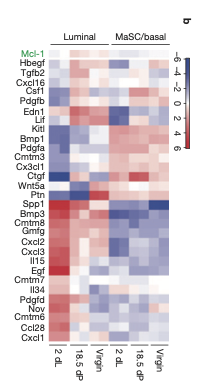

```{r setup}
knitr::opts_chunk$set(echo = TRUE)
```

# Introduction to this Project

This project provides a complete run-down and protocol for RNA-Seq and other HTS-data analytics starting with programmatic sourcing of read data and metadata, cleaning and mapping read data with `subread`, souring reference genome and associated annotation data from Ensembl, counting mapped reads by features with `featureCounts` in R, and a full analytic, inferential and visualization workflow for bulk RNA-seq data with an eye towards comparing the performance, quality of fit, uncertainty in predicted estimates, power to predict DEGs of alternative DEG-prediction pipelines `edgeR` and `limma-voom`.

## Practical and Biological Background and Motivation for This Project

In order to make this project doable in a reasonable time on a personal computer with limited storage, memory, network bandwidth and compute power, we will only download a subset of the read data from an already known example with full results to compare to, and compare our results from under-sampled data for power to detect DEGs

We will analyze data from one of the edgeR User Guide's Case Study Examples, taken from Section 4.4 "RNA-Seq profiles of mouse mammary gland" of the [EdgeR User's Guide](https://www.bioconductor.org/packages/devel/bioc/vignettes/edgeR/inst/doc/edgeRUsersGuide.pdf), last revised 26 October 2024. The following description of the study is modified from the User's Guide:

> The RNA-Seq data of this case study is described in Fu, N.Y. *et al.* (2015). EGF-mediated induction of *Mcl-1* at the switch to lactation is essential for alveolar cell survival. [*Nature Cell Biology* **17**:365](https://www.nature.com/articles/ncb3117) (note that genes are written in italic face). The sequence and count data are publicly available from the Gene Expression Omnibus (GEO) at the series accession number [GSE60450](https://www.ncbi.nlm.nih.gov/geo/query/acc.cgi?acc=GSE60450). This study examines the expression profiles of basal stem-cell enriched cells (B) and committed luminal cells (L) in the mammary gland of virgin, pregnant and lactating mice. Six groups are present, with one for each combination of cell type and mouse status. Each group contains two biological replicates. This is summarized in the table below, where the basal and luminal cell types are abbreviated with B and L respectively.

According to the methods section of this paper:

> RNA-seq analysis. Total RNA was extracted from sorted luminal or basal populations from the mammary glands of virgin, 18.5-day-pregnant and 2-day-lactating FVB/N female mice (two independent samples per stage). Total RNA (100 ng) was used to generate libraries for whole-transcriptome analysis following Illumina’s TruSeq RNA v2 sample preparation protocol. Libraries were sequenced on an Illumina HiSeq 2000 at the Australian Genome Research Facility (AGRF), Melbourne. At least 20 million 100 bp single-end reads were obtained for each sample. Reads were aligned to the mouse genome mm10 using Rsubread version 13.25 (ref. 51). The number of reads overlapping each Entrez gene was counted using RefSeq gene annotation and featureCounts. Filtering and normalization used the edgeR package. Genes were filtered as unexpressed if their average count per million (CPM) computed by the aveLogCPM function was less than one. Compositional differences between libraries were normalized using the trimmed mean of M-values (TMM) method. Differential expression was analysed used the Limma package. Counts were transformed to log2-CPM values with associated precision weights using voom. Differential expression was assessed using the TREAT method, whereby differential expression is evaluated relative to a biologically meaningful fold-change threshold. Genes were considered to be differentially expressed if they achieved a false discovery rate of 1% in exceeding a fold-change of 1.5. Gene ontology analysis used the goseq package, which corrects the analysis for gene length bias. Log-CPM values shown in heat maps were computed using the edgeR package with a prior.count of 3 to reduce variability at low counts.

# Setting up Project Directory

We organized the project directory to ensure all files and outputs were structured for efficient analysis. The folder contained subdirectories for the analysis script, figures, downloaded data (reads and reference genomes), and related annotation data. This setup facilitated smooth progression through the RNA-Seq workflow.

## Downloaded Metadata and Read Data

We began by obtaining metadata and read data from the NCBI GEO database. Specifically, we accessed the GEO accession GSE60450 via the SRA Run Selector tool. From this portal, we downloaded the "Accession List" (a list of SRR accession numbers) and the "Metadata" file. These files were essential for linking sample information to the raw sequencing data. The metadata file was downloaded as SraRunTable.csv, while the accession list was saved as SRR_Acc_List.txt.

For downloading the raw reads, we utilized the UNIX-based SRA Toolkit. This tool allowed us to programmatically fetch data corresponding to the accession numbers. Using a subset of reads ensured the workflow remained manageable on personal computing resources while preserving sufficient data for meaningful analysis.

## Cleaned and Processed Metadata

Once the metadata was downloaded, we cleaned and reshaped it into a format compatible with our analysis pipeline. Specifically, we created a targets.txt file, which summarized the key attributes of each sample. This step involved sorting and extracting information about cell type, biological status, and GEO accession numbers from the SraRunTable.csv. The resulting file provided a structured view of the experimental design, serving as input for downstream analyses.

## Extracted Sequence Statistics

To assess the sequence libraries, we queried statistics such as the number of reads for each sample. This step ensured that the downloaded data aligned with our expectations and experimental requirements. The statistics were extracted programmatically from the SRR accession list, with outputs stored in a summary file. This information confirmed the integrity and consistency of the dataset.

## Preprocessing and Quality Control

### Downloaded and Trimmed Reads

We downloaded a subset of reads from each sample to reduce computational overhead while retaining representative data. The read files were processed to remove technical artifacts such as adapter sequences and low-quality bases. This was achieved using the fastp tool, which performed trimming and cleaning operations. For each processed file, we generated detailed HTML and JSON reports summarizing the trimming statistics.

### Assessed Quality of Reads

To evaluate the quality of the cleaned reads, we used FastQC. This tool provided visual summaries of sequence quality metrics, such as per-base quality scores, duplication levels, and GC content. The outputs were reviewed to identify any potential issues with the sequencing data.

### Aggregated Quality Reports

Finally, we used MultiQC to aggregate the quality control results from fastp and FastQC. This step produced a comprehensive HTML report summarizing the quality metrics across all samples. The report highlighted any inconsistencies or areas requiring further attention, ensuring the data was ready for mapping and downstream analysis.

## Downloaded and Prepared the Reference Genome

To map reads, we downloaded the masked primary assembly of the mouse reference genome (GRCm39) from Ensembl, along with its associated annotation file in GTF format. These files provided the genomic coordinates and features needed for aligning RNA-Seq reads and counting gene-level expression. The reference genome files were organized into a dedicated subdirectory within the project folder.

## Built Genome Index

Using the downloaded reference genome, we built a genome index to facilitate efficient read alignment. The indexing process prepared the genome for compatibility with the subread alignment tool, creating binary index files optimized for rapid read mapping. This step was critical for ensuring accurate and resource-efficient alignments.

## Mapped Reads to the Genome
We mapped the processed reads to the mouse reference genome using subread-align, a tool known for its speed and accuracy. The alignment parameters included options for handling multi-mapped reads and specifying the RNA-Seq data type. We also adjusted the number of processing threads to optimize runtime based on system resources. The resulting BAM files stored the mapped read data, which would be used for downstream feature counting and differential expression analysis.

# Count Reads Mapping to Features in R

## Install Rsubread

```{r, eval=FALSE}
BiocManager::install("Rsubread")
```

## Set-up "Targets" (Sample Information) and Groups

Here we'll use the `targets.txt` file that we set-up earlier to parametrize sample information in our analysis, and combine the factors of cell-type (Basal vs Luminal cells) and life history stage of the mice (virgin, pregnant, lactating) into a single one-way factor for analysis.

```{r readTargets}
targets <- read.delim("targets.txt", header=TRUE)
targets
group <- factor(paste0(targets$CellType, ".", targets$Status))
```

## Count Mapped Reads

By default, `Rsubread::featureCounts()` uses genome feature annotations in its custom "SAF" format, so we need to tell it that the mouse external annotation is in "GTF" format.

```{r counting}
output.files <- sub("^","GSE60450/",sub(".gz", ".subread-align.bam", targets$FileName))
library(Rsubread)
fc <- featureCounts(output.files,annot.ext = "Mus_musculus.GRCm39/Mus_musculus.GRCm39.113.gtf.gz",isGTFAnnotationFile = T)
colnames(fc$counts) <- 1:12
```

# Create DGEList for Analysis

The edgeR package is used for elementary functions in setting up the data object for analysis for both limma and edgeR. Make sure to install edgeR from BioConductor using `BiocManager` if it's not already installed.

## Create and Parametrize DGEList

```{r, message=FALSE}
library(edgeR)
y <- DGEList(fc$counts, group=group)
colnames(y) <- targets$GEO
```

## Remap Ensemble Gene IDs to More Recognizable Gene Symbols

We will install the Mouse AnnotationHub package org.Mm.eg.db for remapping gene identifiers from BioConductor using `BiocManager`.

```{r renaming, message=FALSE}
require(org.Mm.eg.db)
Symbol <- mapIds(org.Mm.eg.db, keys=rownames(y), keytype="ENSEMBL",column="SYMBOL")
Symbol[is.na(Symbol)] <- names(Symbol[is.na(Symbol)])
y$genes <- data.frame(Symbol=Symbol)
```

# Filter Low-Expressed Genes

```{r filtering}
keep <- filterByExpr(y)
summary(keep)
y <- y[keep, , keep.lib.sizes=FALSE]
y$samples
```

# Normalize Count Data with TMM

There are at least three problems with the math in Robinson and Oshlack (2010)'s write-up of their highly competitive TMM normalization scale factor for RNA-Seq data. Unfortunately, these errors affect and obscore the definition of the central quantity of interest. Let's review them:

1.  There is inconsistent notation between the main body of text and Materials and Methods, such as that the TMM scaling factor is written differently in the main text ($f_k$) and in the "Materials and Methods" where details are given ($TMM^{(r)}_k$), and different ways of symbolizing the reference sample in the two sections.

2.  The first critical math error is that $M^r_{gk}$ is not correctly re-defined in the "Materials and Methods" section, althouugh it is correctly defined in the main body of the text as:

    -   $M_g = \log_2 \frac{Y_{gk}/N_k}{Y_{gk^{\prime}}/N_{k^{\prime}}}$ , but in the Materials and Methods it is incorrectly written as:

    -   $M^r_{gk} = \frac{\log_2 (Y_{gk}/N_k)}{\log_2(Y_{gr}/N_r)}$ — please note that **the logarithm of a fraction is the not equivalent to the fraction of logarithms.**

3.  The second critical math error is that the weight $w^r_{gk}$ is defined as the "delta method"(Taylor-approximation)-based expression for the **variance of the M-value**, but these weights are described in the text as the **reciprocal of the variance of the M-value**.

Here is a corrected definition for the TMM normalization scaling factor. This definition has been validated based on what the `edgeR::calcNormFactors()` code actually does:

**The TMM normalization scaling factor** $f^r_k$ **of sample** $k$ **relative to sample** $r$ **(Robinson and Oshlack (2010)) and actual calculation of** `edgeR::calcNormFactors()`**is:**

$$ f^r_k = 2^{(\sum_{g \in G^*} w^r_{gk}M^r_{gk}/\sum_{g \in G^*} w^r_{gk})} $$

**where** $M^r_{gk} = \log_2 \frac{Y_{gk} N_r}{Y_{gr} N_k}$ **and** $w^r_{gk} = \big( \frac{N_k - Y_{gk}}{N_k Y_{gk}} + \frac{N_r -Y_{gr}}{N_r Y_{gr}} \big)^{-1}$.

```{r normalizing}
y.calc <- calcNormFactors(y) ## same as normLibSizes for this data
y.calc$samples$norm.factors
```

# Visualize Normalized Counts with Mean-Difference Plots (AKA "MA Plots")

```{r MDplots}
sapply(1:12,function(x){plotMD(cpm(y.calc, log=TRUE), column=x);abline(h=0, col="red", lty=2, lwd=2)})
```

## Exploratory Data Analysis: Visualize Multi-Dimensional Scaling (MDS) Plot of Samples

Limma's `MDSplot()` function is implemented to project the similarities of samples in a low-dimensional projected space. This plot is useful to detect batch effects for example, in which case we would see samples clustering in batches rather than in sample condition groups.

Here is what [the limma documentation](https://www.rdocumentation.org/packages/limma/versions/3.28.14/topics/plotMDS) says about its implementation:

> This function is a variation on the usual multdimensional scaling (or principle coordinate) plot, in that a distance measure particularly appropriate for the microarray context is used. The distance between each pair of samples (columns) is the root-mean-square deviation (Euclidean distance) for the top top genes. Distances on the plot can be interpreted as leading log2-fold-change, meaning the typical (root-mean-square) log2-fold-change between the samples for the genes that distinguish those samples. If gene.selection is "common", then the top genes are those with the largest standard deviations between samples. If gene.selection is "pairwise", then a different set of top genes is selected for each pair of samples. The pairwise feature selection may be appropriate for microarray data when different molecular pathways are relevant for distinguishing different pairs of samples.

Here, we use the default `pairwise` value of `gene.selection`.

```{r MDSplots}
points <- c(0,1,2,15,16,17)
colors <- rep(c("blue", "darkgreen", "red"), 2)
library(limma)
plotMDS(y, col=colors[group], pch=points[group])
legend("topleft", legend=levels(group), pch=points, col=colors, ncol=2)
```

# Analyze Differentially Expressed Genes (DEGs) in Undersampled Data

## Create Design Matrix

Here we use the "group-means" parametrization for a one-way layout; we can use the contrast matrix to define contrasts and interaction effects for the two main factors of cell-type and life history stage of the mice.

```{r designmatrix}
design <- model.matrix(~ 0 + group)
colnames(design) <- levels(group)
design
```

## Define Contrasts of Interest

Here we define contrasts between subsequent life-history stages in mice for each cell type and interaction effects comparing each pair of stages across cell-types.

```{r contrastmatrix}
contrast.matrix <- makeContrasts(
     Lact_vs_Preg_in_B=B.lactate-B.pregnant,
     Lact_vs_Preg_in_L=L.lactate-L.pregnant,     
     Diff_LP=(L.lactate-L.pregnant)-(B.lactate-B.pregnant),
     Preg_vs_Virg_in_B=B.pregnant-B.virgin,
     Preg_vs_Virg_in_L=L.pregnant-L.virgin,     
     Diff_PV=(L.pregnant-L.virgin)-(B.pregnant-B.virgin),
     levels=design)
```

## Compute DEGs with limma-voom

```{r limma-voom}
voom.fit <- voom(y.calc,design,plot=TRUE)
limma.lm.fit <- lmFit(voom.fit, design)
limma.contrasts.fit <- contrasts.fit(limma.lm.fit, contrast.matrix)
limma.ebayes.fit    <- eBayes(limma.contrasts.fit,robust=T)
```

### Sortable and Searchable Top Tables of limma-voom DEGs for Different Contrasts

We will need to install the DT package for the `datatable` function useful to make an sortable and searchable table of results of top DEGs in your knitted output.

By default `limma::topTable` sorts genes by their $B$-value, the posterior log-odds of differential expression.

For example, in the following code-chunk we generate a top-table of the top 100 genes for the contrast of lactating vs pregnant mice in luminal cells features in Figure 6b of Fu et al. (2015), defined as in the contrast matrix so that large B-values correspond to excess expression in the Luminal cells of lactating mice (alternatively sorting by $p$-value would give you both overexpressed and underexpressed genes in this contrast). This is the second contrast defined in the contrast-matrix, so it corresponds to the second coefficient for the call to `topTable()`.

```{r voom-top-table, message=FALSE}
limma.tt <- topTable(limma.ebayes.fit, coef = 2, number = 100, sort.by = "B") # M == LogFC
library(DT)
datatable(limma.tt)
```

We can "sanity-check" our analysis by comparing results to the paper. Below is Figure 6B, and its corresponding caption from the paper.

```{r fig6b, fig.align = 'center', out.width = "50%", fig.cap = "Figure 6b from Fu *et al.* (2015)"}

```

> (b) Heat map of gene expression for Mcl-1 and cytokines/growth factors that are differentially expressed between late pregnancy and early lactation for the luminal population.

For this contrast, we are interested in genes listed with a strong positive LFC in Luminal (L) cells in lactating mice compared to pregnant mice, which have red signals in the heatmap on the lower half of the leftmost column of this figure.

The gene with the sixth-highest B-value is *Spp1* which is shown in the figure. Some other genes shown in the figure are not present in our top 100 genes because they were filtered as low-expression genes in our undersampled reads. But other genes shown in the figure such as *Cxcl1* and *Cxlcl2* are in these top-100 genes.

## Compute DEGs with edgeR

### Estimate and Visualize Dispersion

```{r dispersion}
edgeR.estimateDisp <- estimateDisp(y.calc, design, robust=TRUE)
plotBCV(edgeR.estimateDisp)
```

### Fit Negative Binomial Model and Compute Estimated LogFC for each Gene and Contrast

The second contrast, that we looked at previously with limma-voom, compares Luminal Cells in lactating vs. pregnant mice. Here we pass in the entire contrast matrix for `glmQLFTest` and the corresponding $p$-values obtained are from a likelihood-ratio test over all contrasts.

```{r edgeR}
edgeR.glmQLF.fit <- glmQLFit(edgeR.estimateDisp, design, robust=TRUE)
plotQLDisp(edgeR.glmQLF.fit)
edgeR.glmQLF.estimate <- glmQLFTest(edgeR.glmQLF.fit, contrast = contrast.matrix)
```

### Sortable and Searchable Top Table of edgeR DEGs for All Contrasts

The `edgeR` QL-pipeline-equivalent of `topTable` is `topTags` but it works differently: it sorts genes by default by their $p$-value and if we sort by `logFC` it sorts by absolute value of logFC, and when passing in the entire contrast matrix it computes $p$-values from a likelihood-ratio test over all contrasts. Note that `edgeR::topTags` also returns a different data structure than `limma::topTable`.

To make a topTable more comparable to the one we examined before from limma, we can pass in only one specific column from the contrast matrix to `glmQLFTest` like so:

```{r edgeR-top-table}
edgeR.glmQLF.estimate.coef2 <- glmQLFTest(edgeR.glmQLF.fit, contrast=contrast.matrix[,2])
edgeR.tt <- topTags(edgeR.glmQLF.estimate.coef2, n = 100) # by default sorted by Pvalue
datatable(edgeR.tt$table)
```

We should still be able to find results for the genes that we looked at before in this table, like *Spp1* and *Cxcl2*.

## Compare Numbers of DEGs and Distributions of $p$-values Obtained in Undersampled Data Between `edgeR` and `limma-voom`

Let's compare which method yields more DEGs from our undersampled data for contrast 2 (Luminal cells in Lactating vs Pregnant mice). In order to get p-values for this one contrast, we have to re-run `glmQLFTest` with just the specific column of the contrast matrix we are interested in (see [here](https://support.bioconductor.org/p/117466/) for more information).

```{r}
limma.tt <- topTable(limma.ebayes.fit, coef = 2, number = Inf)
edgeR.tt <- topTags(edgeR.glmQLF.estimate.coef2, n = Inf)
```

Here is a table of number of DEGs/NDEGs for all contrasts from limma for a Benjamini-Hochberg FDR of 10%:

```{r}
summary(decideTests(limma.ebayes.fit,p.value=0.1))
```

Here is the result for just contrast 2 using edgeR.

```{r}
summary(decideTests(edgeR.glmQLF.estimate.coef2,p.value=0.1))
```

Limma finds more DEGs in our undersampled data for this contrast. If we compare the histogram of $p$-values we get a clue as to why:

```{r}
hist(limma.tt$P.Value)
hist(edgeR.tt$table$PValue) 
```

There appears to be an excess of large $p$-values near 1 for edgeR; this indicates that perhaps the nonparametric mean-variance trend modeling of limma may better compensate for under-sampling in this data and not enough data is available to parametrize the distributional mean-variance trend modeling of edgeR.

# Compare Numbers of DEGs and Distributions of $p$-values Obtained in Full Counts Data Between `edgeR` and `limma-voom`

Fu *et al.* (2015) used limma-voom to analyze their data. Let's see if edgeR performs better than limma when analyzing the full data-set of counts that the authors provide on GEO. The results shown here should also be more comparable to the output shown in the edgeR UserGuide Section 4.4 for this data.

First we download and then read in the counts, and then we follow the same analytical workflow documented above.

## Read in Full Counts Data Matrix

```{r}
fullcounts <- read.delim("GSE60450/GSE60450_Lactation-GenewiseCounts.txt")
```

## Rename Columns of Counts Data

The names of columns here need to be mapped back to the GSM identifiers to make the data comparable to what we have analyzed from our under-sampled read-mapped data. The identifiers may be mapped by processing the file "GSE60450_series_matrix.txt.gz" obtainable when we click the link "Series Matrix File(s)" from the GEO record. We have done this and renamed the data columns in the code chunk below.

```{r}
sample_names <- c("MCL1.LA_BC2CTUACXX_GATCAG_L001_R1","MCL1.LB_BC2CTUACXX_TGACCA_L001_R1","MCL1.LC_BC2CTUACXX_GCCAAT_L001_R1","MCL1.LD_BC2CTUACXX_GGCTAC_L001_R1","MCL1.LE_BC2CTUACXX_TAGCTT_L001_R1","MCL1.LF_BC2CTUACXX_CTTGTA_L001_R1","MCL1.DG_BC2CTUACXX_ACTTGA_L002_R1","MCL1.DH_BC2CTUACXX_CAGATC_L002_R1","MCL1.DI_BC2CTUACXX_ACAGTG_L002_R1","MCL1.DJ_BC2CTUACXX_CGATGT_L002_R1","MCL1.DK_BC2CTUACXX_TTAGGC_L002_R1","MCL1.DL_BC2CTUACXX_ATCACG_L002_R1")

ref_ids <- c("GSM1480291","GSM1480292","GSM1480293","GSM1480294","GSM1480295","GSM1480296","GSM1480297","GSM1480298","GSM1480299","GSM1480300","GSM1480301","GSM1480302")

names(ref_ids) <- sample_names

names(fullcounts)[3:14] <- ref_ids[names(fullcounts)[3:14]]
```

## Set up DGElist, Filter and Normalize Data

```{r, message=FALSE}
y.full <- DGEList(fullcounts[,3:14], group=group)
library(org.Mm.eg.db)
Symbol <- mapIds(org.Mm.eg.db, keys=as.character(fullcounts$EntrezGeneID), keytype="ENTREZID",column="SYMBOL")
Symbol[is.na(Symbol)] <- names(Symbol[is.na(Symbol)])
y.full$genes <- data.frame(Symbol=Symbol)
keep <- filterByExpr(y.full)
y.full <- y.full[keep, , keep.lib.sizes=FALSE]
y.full$samples
y.fullnorm <- calcNormFactors(y.full) ## same as normLibSizes for this data
```

## Visualize Normalized Data and MDS Plots

```{r}
sapply(1:2,function(x){plotMD(cpm(y.fullnorm, log=TRUE), column=x);abline(h=0, col="red", lty=2, lwd=2)})
points <- c(0,1,2,15,16,17)
colors <- rep(c("blue", "darkgreen", "red"), 2)
plotMDS(y.fullnorm, col=colors[group], pch=points[group])
legend("topleft", legend=levels(group), pch=points, col=colors, ncol=2)
```

## Compute DEGs with Limma

Here we use limma without the option `robust = T` since there is so much data

```{r}
voom.fit.full <- voom(y.fullnorm,design,plot=TRUE)
limma.lm.fit.full <- lmFit(voom.fit.full, design)
limma.contrasts.fit.full <- contrasts.fit(limma.lm.fit.full, contrast.matrix)
limma.ebayes.fit.full    <- eBayes(limma.contrasts.fit.full)
limma.tt.full <- topTable(limma.ebayes.fit.full, coef = 2, number = Inf)
```

## Compute DEGs with edgeR QL

```{r}
edgeR.estimateDisp.full <- estimateDisp(y.fullnorm, design)
plotBCV(edgeR.estimateDisp.full)
edgeR.glmQLF.fit.full <- glmQLFit(edgeR.estimateDisp.full, design)
plotQLDisp(edgeR.glmQLF.fit.full)
edgeR.glmQLF.estimate.coef2.full <- glmQLFTest(edgeR.glmQLF.fit.full, contrast=contrast.matrix[,2])
edgeR.tt.full <- topTags(edgeR.glmQLF.estimate.coef2.full, n = Inf) # by default sorted by Pvalue
```

## Compare number of DEGs and Distributions of $p$-values for Full Counts Data Between EdgeR and Limma

```{r}
summary(decideTests(limma.ebayes.fit.full,p.value=0.1))
```

Here is the result for just contrast 2 using edgeR:

```{r}
summary(decideTests(edgeR.glmQLF.estimate.coef2.full,p.value=0.1))
```

In contrast with the undersampled data, with the full data, now EdgeR finds more DEGs. The histograms of $p$-values show that edgeR still has an excees of $p$-values near 1 compared to limma, but the effect is relatively smaller.

```{r}
hist(limma.tt.full$P.Value)
hist(edgeR.tt.full$table$PValue) 
```

# Increasing DEGs Using Local fdrs

Let's proceed with the full dataset and the EdgeR estimates, and apply what we have learned about FDRs to increase the number of DEGs for each contrast.

First let's get $p$-values for all genes for all six of our contrasts.

```{r}
edgeR.glmQLF.estimate.coef1.full <- glmQLFTest(edgeR.glmQLF.fit.full, contrast=contrast.matrix[,1])
edgeR.glmQLF.estimate.coef2.full <- glmQLFTest(edgeR.glmQLF.fit.full, contrast=contrast.matrix[,2])
edgeR.glmQLF.estimate.coef3.full <- glmQLFTest(edgeR.glmQLF.fit.full, contrast=contrast.matrix[,3])
edgeR.glmQLF.estimate.coef4.full <- glmQLFTest(edgeR.glmQLF.fit.full, contrast=contrast.matrix[,4])
edgeR.glmQLF.estimate.coef5.full <- glmQLFTest(edgeR.glmQLF.fit.full, contrast=contrast.matrix[,5])
edgeR.glmQLF.estimate.coef6.full <- glmQLFTest(edgeR.glmQLF.fit.full, contrast=contrast.matrix[,6])
```

Next, let's extract the full topTag tables with the $p$-values.

```{r}
edgeR.tt.full.coef1 <- topTags(edgeR.glmQLF.estimate.coef1.full, n = Inf)
edgeR.tt.full.coef2 <- topTags(edgeR.glmQLF.estimate.coef2.full, n = Inf)
edgeR.tt.full.coef3 <- topTags(edgeR.glmQLF.estimate.coef3.full, n = Inf)
edgeR.tt.full.coef4 <- topTags(edgeR.glmQLF.estimate.coef4.full, n = Inf)
edgeR.tt.full.coef5 <- topTags(edgeR.glmQLF.estimate.coef5.full, n = Inf)
edgeR.tt.full.coef6 <- topTags(edgeR.glmQLF.estimate.coef6.full, n = Inf)
```

Then let's estimate $\pi_0$, the fraction of NDEGs, for each contrast.

```{r}
library(FDRestimation)
pi0.coef1 <- get.pi0(edgeR.tt.full.coef1$table$PValue)
pi0.coef1
pi0.coef2 <- get.pi0(edgeR.tt.full.coef2$table$PValue)
pi0.coef2
pi0.coef3 <- get.pi0(edgeR.tt.full.coef3$table$PValue)
pi0.coef3
pi0.coef4 <- get.pi0(edgeR.tt.full.coef4$table$PValue)
pi0.coef4
pi0.coef5 <- get.pi0(edgeR.tt.full.coef5$table$PValue)
pi0.coef5
pi0.coef6 <- get.pi0(edgeR.tt.full.coef6$table$PValue)
pi0.coef6
```

As a reminder, our contrasts are in the order "Lact_vs_Preg_in_B Lact_vs_Preg_in_L Diff_LP Preg_vs_Virg_in_B Preg_vs_Virg_in_L Diff_PV" so as expected, the two interaction effects (differences across cell-types for the two differences in life history stages) have the highest estimated proportion of NDEGs.

Now let's estimate the fdrs:

```{r, warning=FALSE}
p.fdr.obj.coef1 <- p.fdr(p=edgeR.tt.full.coef1$table$PValue,set.pi0 = pi0.coef1)
p.fdr.obj.coef2 <- p.fdr(p=edgeR.tt.full.coef2$table$PValue,set.pi0 = pi0.coef2)
p.fdr.obj.coef3 <- p.fdr(p=edgeR.tt.full.coef3$table$PValue,set.pi0 = pi0.coef3)
p.fdr.obj.coef4 <- p.fdr(p=edgeR.tt.full.coef4$table$PValue,set.pi0 = pi0.coef4)
p.fdr.obj.coef5 <- p.fdr(p=edgeR.tt.full.coef5$table$PValue,set.pi0 = pi0.coef5)
p.fdr.obj.coef6 <- p.fdr(p=edgeR.tt.full.coef6$table$PValue,set.pi0 = pi0.coef6)
```

```{r, warning=FALSE}
p.fdr.obj.coef1 <- p.fdr(p=edgeR.tt.full.coef1$table$PValue,set.pi0 = pi0.coef1)
p.fdr.obj.coef2 <- p.fdr(p=edgeR.tt.full.coef2$table$PValue,set.pi0 = pi0.coef2)
p.fdr.obj.coef3 <- p.fdr(p=edgeR.tt.full.coef3$table$PValue,set.pi0 = pi0.coef3)
p.fdr.obj.coef4 <- p.fdr(p=edgeR.tt.full.coef4$table$PValue,set.pi0 = pi0.coef4)
p.fdr.obj.coef5 <- p.fdr(p=edgeR.tt.full.coef5$table$PValue,set.pi0 = pi0.coef5)
p.fdr.obj.coef6 <- p.fdr(p=edgeR.tt.full.coef6$table$PValue,set.pi0 = pi0.coef6)
```

To compare how many more DEGs we get with this method, let's start first with DEG statistics using edgeR's own Benjamiini-Hochberg FDRs and an FDR cut-off of 1% (which is also what Fu et al used):

```{r}
summary(decideTests(edgeR.glmQLF.estimate.coef1.full,p.value=0.01))
summary(decideTests(edgeR.glmQLF.estimate.coef2.full,p.value=0.01))
summary(decideTests(edgeR.glmQLF.estimate.coef3.full,p.value=0.01))
summary(decideTests(edgeR.glmQLF.estimate.coef1.full,p.value=0.01))
summary(decideTests(edgeR.glmQLF.estimate.coef2.full,p.value=0.01))
summary(decideTests(edgeR.glmQLF.estimate.coef3.full,p.value=0.01))
```

```{r}
summary(p.fdr.obj.coef1$fdrs <= 0.01)
summary(p.fdr.obj.coef2$fdrs <= 0.01)
summary(p.fdr.obj.coef3$fdrs <= 0.01)
summary(p.fdr.obj.coef4$fdrs <= 0.01)
summary(p.fdr.obj.coef5$fdrs <= 0.01)
summary(p.fdr.obj.coef6$fdrs <= 0.01)
```

The numbers of DEGs increases by about 50%.

# Visualizing DEGs Using Wordclouds

Let's use Wordclouds to visualize DEGs for the edgeR fit for the full data counts and the local fdrs less than or equal to 1%.

## Coefficient 1: Overexpressed in B cells in Lactating vs Pregnant Mice

Please note that the following shows only DEGs that are overexpressed in the B cells of Lactating Mice relative to Pregnant Mice. If we separately wanted to visualize DEGs overexpressed in pregnant mice, we would need to filter for negative log-fold-changes.

```{r}
library(wordcloud2)
termdata <- edgeR.tt.full.coef1$table$Symbol[p.fdr.obj.coef1$fdrs <= 0.01 & edgeR.tt.full.coef1$table$logFC > 0]
freqdata <- edgeR.tt.full.coef1$table$logFC[p.fdr.obj.coef1$fdrs <= 0.01 & edgeR.tt.full.coef1$table$logFC > 0]

termdataFC <- edgeR.tt.full.coef1$table$logFC[p.fdr.obj.coef1$fdrs <= 0.01 & edgeR.tt.full.coef1$table$logFC > 0]
termdata <- termdata[order(termdataFC,decreasing=TRUE)]
freqdata <- freqdata[order(termdataFC,decreasing=TRUE)]

# limit to top 500 terms
termdata <- termdata[1:500]
freqdata <- freqdata[1:500]

# add a title to wordcloud2, from
# https://stackoverflow.com/questions/66957909/add-a-title-and-remove-whitespace-from-wordcloud2
layout(matrix(c(1, 2), nrow = 2), heights = c(1, 1))
par(mar = rep(0, 4))
plot.new()
text(
  x = 0.5,
  y = 0.5,
  "Overexpressed in B cells in Lactating vs Pregnant Mice",
  cex = 1.5,
  font = 2
)

wordcloud2(data = data.frame(word=termdata,freq=freqdata),size=0.2)
```

## Coefficient 2: Overexpressed in L cells in Lactating vs Pregnant Mice

```{r}
library(wordcloud2)
termdata <- edgeR.tt.full.coef2$table$Symbol[p.fdr.obj.coef2$fdrs <= 0.01 & edgeR.tt.full.coef2$table$logFC > 0]
freqdata <- edgeR.tt.full.coef2$table$logFC[p.fdr.obj.coef2$fdrs <= 0.01 & edgeR.tt.full.coef2$table$logFC > 0]

termdataFC <- edgeR.tt.full.coef2$table$logFC[p.fdr.obj.coef2$fdrs <= 0.01 & edgeR.tt.full.coef2$table$logFC > 0]
termdata <- termdata[order(termdataFC,decreasing=TRUE)]
freqdata <- freqdata[order(termdataFC,decreasing=TRUE)]

# limit to top 500 terms
termdata <- termdata[1:500]
freqdata <- freqdata[1:500]

# add a title to wordcloud2, from
# https://stackoverflow.com/questions/66957909/add-a-title-and-remove-whitespace-from-wordcloud2
layout(matrix(c(1, 2), nrow = 2), heights = c(1, 1))
par(mar = rep(0, 4))
plot.new()
text(
  x = 0.5,
  y = 0.5,
  "Overexpressed in L cells in Lactating vs Pregnant Mice",
  cex = 1.5,
  font = 2
)

wordcloud2(data = data.frame(word=termdata,freq=freqdata),size=0.2)
```

## Coefficient 3: Excess Change in L cells Relative to B cells in Lactating vs Pregnant Mice

```{r}
library(wordcloud2)
termdata <- edgeR.tt.full.coef3$table$Symbol[p.fdr.obj.coef3$fdrs <= 0.01 & edgeR.tt.full.coef3$table$logFC > 0]
freqdata <- edgeR.tt.full.coef3$table$logFC[p.fdr.obj.coef3$fdrs <= 0.01 & edgeR.tt.full.coef3$table$logFC > 0]

termdataFC <- edgeR.tt.full.coef3$table$logFC[p.fdr.obj.coef3$fdrs <= 0.01 & edgeR.tt.full.coef3$table$logFC > 0]
termdata <- termdata[order(termdataFC,decreasing=TRUE)]
freqdata <- freqdata[order(termdataFC,decreasing=TRUE)]

# limit to top 500 terms
termdata <- termdata[1:500]
freqdata <- freqdata[1:500]

# add a title to wordcloud2, from
# https://stackoverflow.com/questions/66957909/add-a-title-and-remove-whitespace-from-wordcloud2
layout(matrix(c(1, 2), nrow = 2), heights = c(1, 1))
par(mar = rep(0, 4))
plot.new()
text(
  x = 0.5,
  y = 0.5,
  "Excess Overexpression in L cells Relative to B cells in Lactating vs Pregnant Mice",
  cex = 1.5,
  font = 2
)

wordcloud2(data = data.frame(word=termdata,freq=freqdata),size=0.2)
```
